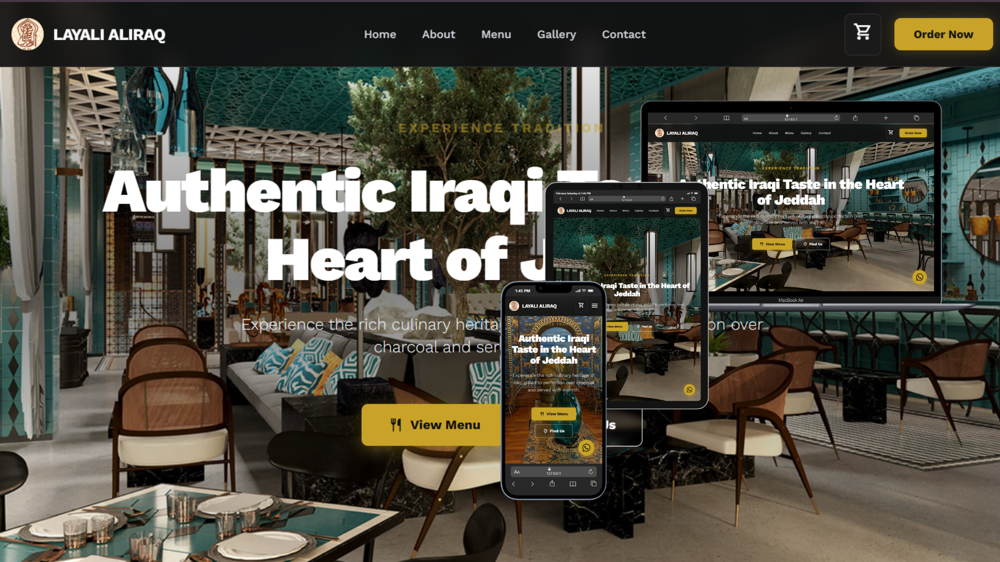

# Layali Al Iraq Website

---

---
## Description
Responsive website for **Layali Al Iraq** restaurant, showcasing authentic Iraqi cuisine in the heart of Jeddah. The site includes a home page, menu, gallery, and contact information with modern and clean design.

## Features
- Fully responsive design for desktop, tablet, and mobile.
- Home page highlighting the restaurant's atmosphere and specialty dishes.
- Menu section with images and detailed descriptions of dishes.
- Gallery showcasing restaurant interior and food.
- Contact section with location, social media, and order options.
- "Order Now" button integrated with WhatsApp link.

## Tech Stack
- HTML5
- CSS3 (TailwindCSS)
- JavaScript (for interactive elements)
- Responsive design with mobile-first approach

## Installation
1. Clone the repository:
```bash
git clone https://github.com/simo-SM/layali-aliraq-website.git)

## Description
Responsive website for **Layali Al Iraq** restaurant, showcasing authentic Iraqi cuisine in the heart of Jeddah. The site includes a home page, menu, gallery, and contact information with modern and clean design.

## Features
- Fully responsive design for desktop, tablet, and mobile.
- Home page highlighting the restaurant's atmosphere and specialty dishes.
- Menu section with images and detailed descriptions of dishes.
- Gallery showcasing restaurant interior and food.
- Contact section with location, social media, and order options.
- "Order Now" button integrated with WhatsApp link.

## Tech Stack
- HTML5
- CSS3 (TailwindCSS)
- JavaScript (for interactive elements)
- Responsive design with mobile-first approach

## Installation
1. Clone the repository:
```bash
